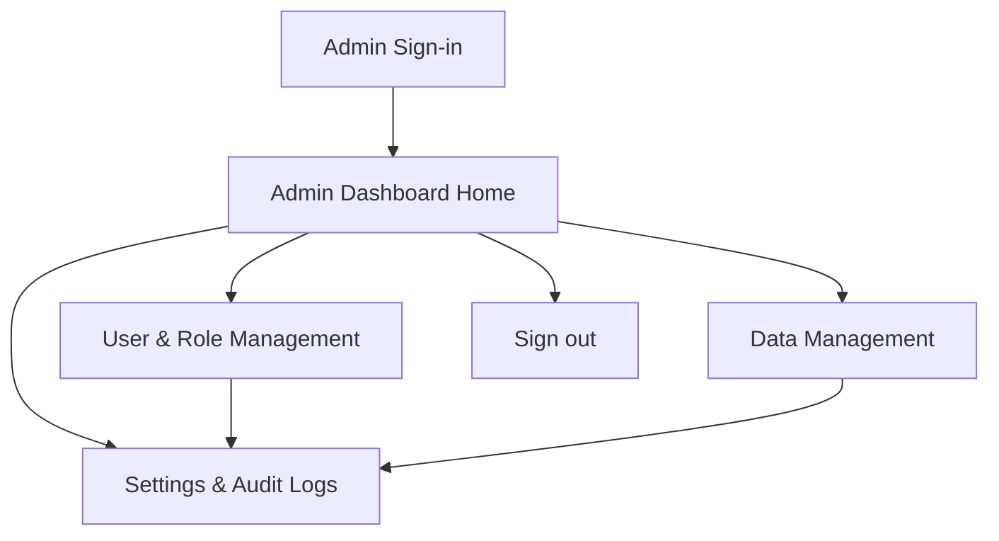

## 1. Product Overview
An Admin Dashboard module that lets authorized administrators manage access, core data, and system configuration safely.
It provides a clear operational view (activity + status) and controlled CRUD tools for day-to-day administration.

## 2. Core Features

### 2.1 User Roles
| Role | Registration Method | Core Permissions |
|------|---------------------|------------------|
| Super Admin | Seeded/first admin, or invited | Full access: manage roles/permissions, users, data, settings, audit logs |
| Admin | Invited (email) | Manage users (non-super), manage data, view audit logs, edit settings (scoped) |
| Auditor | Invited (email) | Read-only access to data + audit logs |

### 2.2 Feature Module
The Admin Dashboard requirements consist of the following main pages:
1. **Admin Sign-in**: authentication, forgot password, access error handling.
2. **Admin Dashboard Home**: KPI/status cards, quick actions, recent activity/audit preview.
3. **User & Role Management**: user list, role assignment, account enable/disable, role/permission editor.
4. **Data Management**: searchable record tables, create/edit forms, bulk import/export.
5. **Settings & Audit Logs**: system settings editor, audit log viewer with filtering and export.

### 2.3 Page Details
| Page Name | Module Name | Feature description |
|-----------|-------------|---------------------|
| Admin Sign-in | Auth form | Authenticate via email/password; show errors; redirect to Admin Dashboard on success. |
| Admin Sign-in | Password recovery | Send password reset request; confirm reset completion. |
| Admin Dashboard Home | Admin shell | Show persistent top bar + left navigation; enforce role-gated navigation items. |
| Admin Dashboard Home | Overview widgets | Display configurable KPI/status cards; provide quick links to common tasks. |
| Admin Dashboard Home | Recent activity | List most recent audit events; link to Audit Logs page with pre-applied filter. |
| User & Role Management | User list | Search/sort users; view user details; enable/disable account access (soft). |
| User & Role Management | Role assignment | Assign/unassign roles to a user; prevent privilege escalation (non-super cannot grant super). |
| User & Role Management | Role editor | Create/update roles; map permissions to roles; validate unique role names. |
| Data Management | Record directory | Select a managed entity type; list records with paging/search/filter; open create/edit. |
| Data Management | Record editor | Create/update record fields; validate inputs; show last updated metadata. |
| Data Management | Bulk operations | Import CSV; export filtered results; show job outcome/errors for failed rows. |
| Settings & Audit Logs | Settings | Edit key/value configuration; show change history (via audit events). |
| Settings & Audit Logs | Audit logs | Filter by actor/action/entity/date; view event details; export to CSV. |

## 3. Core Process
**Super Admin flow:** Sign in → land on Dashboard → manage users/roles → manage data → update settings → review/export audit logs.

**Admin flow:** Sign in → land on Dashboard → manage data and non-privileged users → update allowed settings → review audit logs.

**Auditor flow:** Sign in → land on Dashboard → read data → review/export audit logs (read-only).

