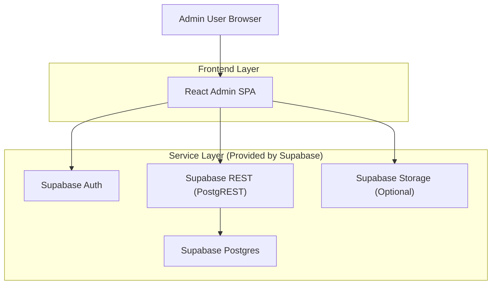
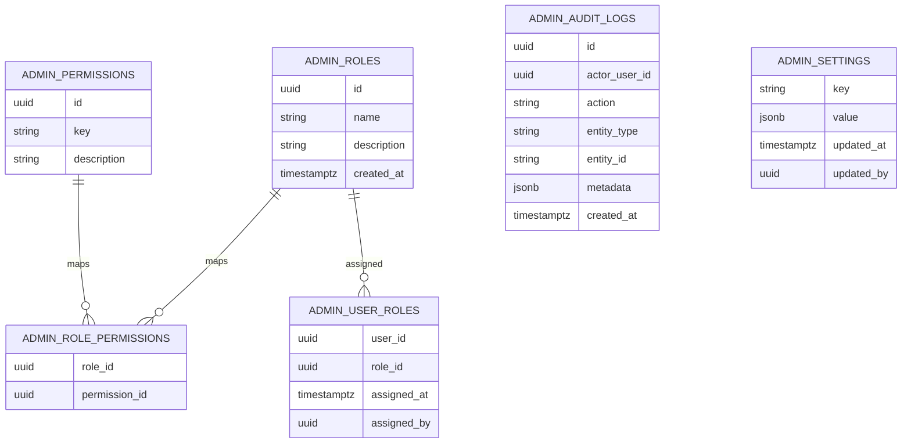

## 1.Architecture design


## 2.Technology Description
- Frontend: React@18 + TypeScript + vite + tailwindcss@3
- Backend: Supabase (Auth + Postgres + PostgREST; Storage optional for import/export files)

## 3.Route definitions
| Route | Purpose |
|-------|---------|
| /admin/login | Admin authentication and recovery actions |
| /admin | Admin dashboard home (overview + recent activity) |
| /admin/users | User list + user detail + role assignment |
| /admin/roles | Role + permission management |
| /admin/data | Managed entity selection + record tables |
| /admin/data/:entity/:id | Record create/edit view |
| /admin/settings | System configuration editor |
| /admin/audit | Audit log list + detail + export |

## 4.API definitions (Supabase REST used by frontend)
### 4.1 REST endpoints (PostgREST)
All endpoints require a valid authenticated session; authorization is enforced via RLS.

| Purpose | Method | Path | Notes |
|--------|--------|------|------|
| List roles | GET | /rest/v1/admin_roles | Supports select, filters, ordering |
| Create role | POST | /rest/v1/admin_roles | Super Admin only |
| Update role | PATCH | /rest/v1/admin_roles?id=eq.{roleId} | Super Admin only |
| List permissions | GET | /rest/v1/admin_permissions | Typically read-only |
| Set role permissions | POST/DELETE | /rest/v1/admin_role_permissions | Super Admin only |
| List user-role assignments | GET | /rest/v1/admin_user_roles | Filter by user_id/role_id |
| Assign role to user | POST | /rest/v1/admin_user_roles | Prevent self-escalation via RLS |
| Revoke role from user | DELETE | /rest/v1/admin_user_roles?user_id=eq.{u}&role_id=eq.{r} | Super Admin only for privileged roles |
| Write audit event | POST | /rest/v1/admin_audit_logs | Server-calculated actor_user_id via RLS defaults | 
| Read audit events | GET | /rest/v1/admin_audit_logs | Auditor allowed; Admin allowed |
| Read/update settings | GET/PATCH | /rest/v1/admin_settings | Super/Admin scoped by RLS |

### 4.2 Shared TypeScript types (recommended)
```ts
export type AdminRole = {
  id: string;
  name: string;
  description: string | null;
  created_at: string;
};

export type AdminPermission = {
  id: string;
  key: string; // e.g. "users.write"
  description: string | null;
};

export type AdminUserRole = {
  user_id: string;
  role_id: string;
  assigned_at: string;
  assigned_by: string | null;
};

export type AdminAuditLog = {
  id: string;
  actor_user_id: string;
  action: string; // e.g. "user.disable"
  entity_type: string; // e.g. "user"
  entity_id: string;
  metadata: Record<string, unknown> | null;
  created_at: string;
};

export type AdminSetting = {
  key: string;
  value: Record<string, unknown>;
  updated_at: string;
  updated_by: string | null;
};
```

## 6.Data model(if applicable)

### 6.1 Data model definition


### 6.2 Data Definition Language
Admin roles (admin_roles)
```sql
CREATE TABLE admin_roles (
  id UUID PRIMARY KEY DEFAULT gen_random_uuid(),
  name TEXT UNIQUE NOT NULL,
  description TEXT,
  created_at TIMESTAMPTZ NOT NULL DEFAULT now()
);

CREATE TABLE admin_permissions (
  id UUID PRIMARY KEY DEFAULT gen_random_uuid(),
  key TEXT UNIQUE NOT NULL,
  description TEXT
);

CREATE TABLE admin_role_permissions (
  role_id UUID NOT NULL,
  permission_id UUID NOT NULL,
  PRIMARY KEY (role_id, permission_id)
);

CREATE TABLE admin_user_roles (
  user_id UUID NOT NULL,
  role_id UUID NOT NULL,
  assigned_at TIMESTAMPTZ NOT NULL DEFAULT now(),
  assigned_by UUID,
  PRIMARY KEY (user_id, role_id)
);

CREATE TABLE admin_audit_logs (
  id UUID PRIMARY KEY DEFAULT gen_random_uuid(),
  actor_user_id UUID NOT NULL,
  action TEXT NOT NULL,
  entity_type TEXT NOT NULL,
  entity_id TEXT NOT NULL,
  metadata JSONB,
  created_at TIMESTAMPTZ NOT NULL DEFAULT now()
);

CREATE INDEX idx_admin_audit_logs_created_at ON admin_audit_logs (created_at DESC);
CREATE INDEX idx_admin_audit_logs_actor ON admin_audit_logs (actor_user_id);
CREATE INDEX idx_admin_user_roles_user ON admin_user_roles (user_id);

CREATE TABLE admin_settings (
  key TEXT PRIMARY KEY,
  value JSONB NOT NULL DEFAULT '{}'::jsonb,
  updated_at TIMESTAMPTZ NOT NULL DEFAULT now(),
  updated_by UUID
);
```

Recommended RLS approach (high level)
```sql
-- Enable RLS
ALTER TABLE admin_roles ENABLE ROW LEVEL SECURITY;
ALTER TABLE admin_permissions ENABLE ROW LEVEL SECURITY;
ALTER TABLE admin_role_permissions ENABLE ROW LEVEL SECURITY;
ALTER TABLE admin_user_roles ENABLE ROW LEVEL SECURITY;
ALTER TABLE admin_audit_logs ENABLE ROW LEVEL SECURITY;
ALTER TABLE admin_settings ENABLE ROW LEVEL SECURITY;

-- Example pattern: allow access only if current user has any admin role
-- (Implement as a reusable policy predicate via EXISTS on admin_user_roles)
-- NOTE: keep privilege escalation rules (e.g., assigning "super_admin") in policies.
```

Initial data (minimal)
```sql
INSERT INTO admin_roles (name, description) VALUES
  ('super_admin', 'Full administrative access'),
  ('admin', 'Operational administration'),
  ('auditor', 'Read-only audit access');

INSERT INTO admin_permissions (key, description) VALUES
  ('users.read', 'Read user accounts'),
  ('users.write', 'Manage user accounts'),
  ('roles.write', 'Manage roles and permissions'),
  ('data.write', 'Create/update managed records'),
  ('settings.write', 'Update system settings'),
  ('audit.read', 'Read audit logs');
```