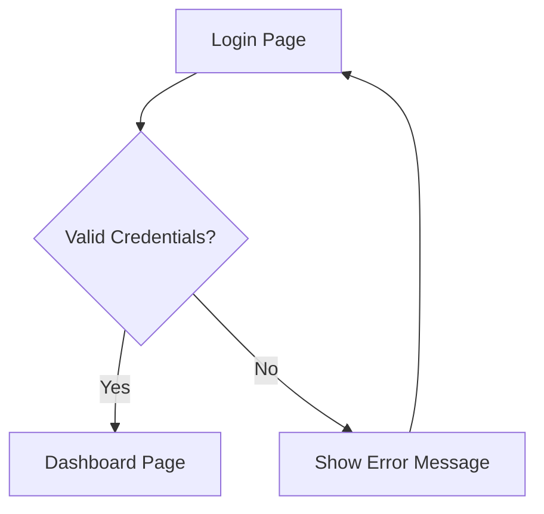

## 1. Product Overview
A simple Church Management System designed for single church administration. This authentication module provides secure admin access with a clean, modern interface for church staff to manage their operations.

Built for JHTM Church to streamline administrative tasks with professional-grade security and user experience.

## 2. Core Features

### 2.1 User Roles
| Role | Registration Method | Core Permissions |
|------|---------------------|------------------|
| Admin | Manual creation via Django admin | Full system access |

### 2.2 Feature Module
The authentication module consists of the following main pages:
1. **Login page**: admin authentication form, error handling, church branding.
2. **Dashboard page**: post-authentication landing area (placeholder for future modules).

### 2.3 Page Details
| Page Name | Module Name | Feature description |
|-----------|-------------|---------------------|
| Login page | Authentication form | Display email and password fields with validation. Show "JHTM Church Management System" branding. Handle login errors with clear messages. |
| Login page | Login button | Submit credentials to backend API. Show loading state during authentication. |
| Login page | Error handling | Display invalid credential messages below form. Clear errors on new input. |
| Dashboard page | Welcome section | Show placeholder content for future church management features. |

## 3. Core Process
Admin users navigate from the login page to the dashboard upon successful authentication. The system validates credentials against Django's built-in authentication system and returns a JWT token for session management.

## 4. User Interface Design

### 4.1 Design Style
- **Primary colors**: Deep blue (#1e40af) with white backgrounds
- **Button style**: Rounded corners (8px radius), subtle shadow on hover
- **Font**: Modern sans-serif (Inter or similar), 16px base size
- **Layout**: Centered card design with max-width 400px
- **Icon style**: Minimal line icons for form fields

### 4.2 Page Design Overview
| Page Name | Module Name | UI Elements |
|-----------|-------------|-------------|
| Login page | Login card | Centered white card with 24px padding, subtle drop shadow (0 4px 6px rgba(0,0,0,0.1)), rounded corners. Church name prominently displayed above form. |
| Login page | Form fields | Clean input fields with 12px padding, 4px rounded corners, light gray borders that turn blue on focus. Labels above fields in 14px font. |
| Login page | Login button | Full-width primary blue button with white text, 16px padding, changes to darker blue on hover. |

### 4.3 Responsiveness
Desktop-first design with mobile adaptation. Login card remains centered on all screen sizes with appropriate padding adjustments for mobile devices (16px card padding on screens < 640px).