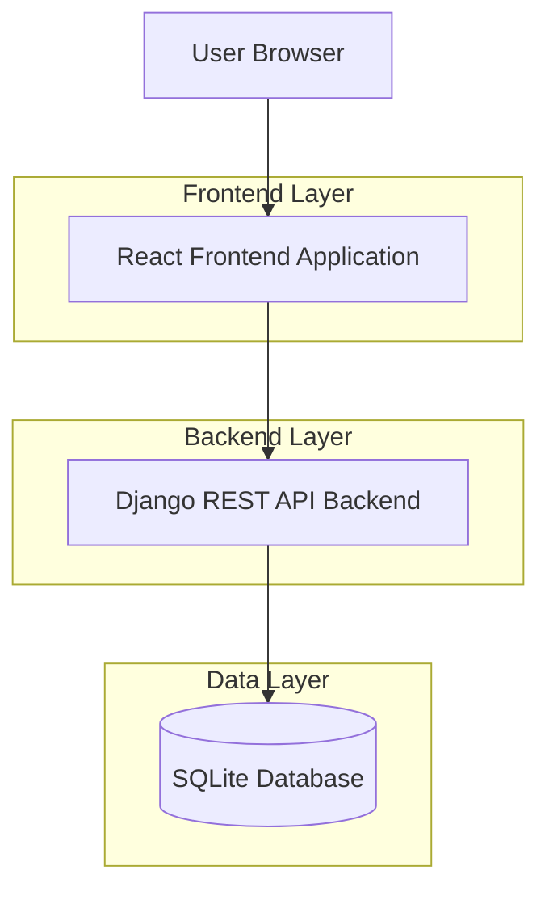
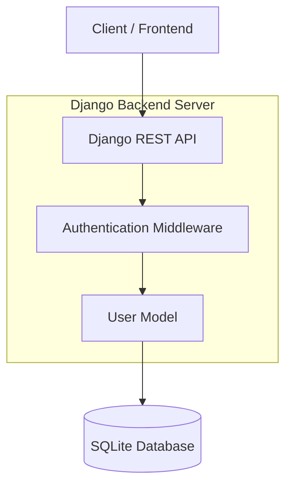
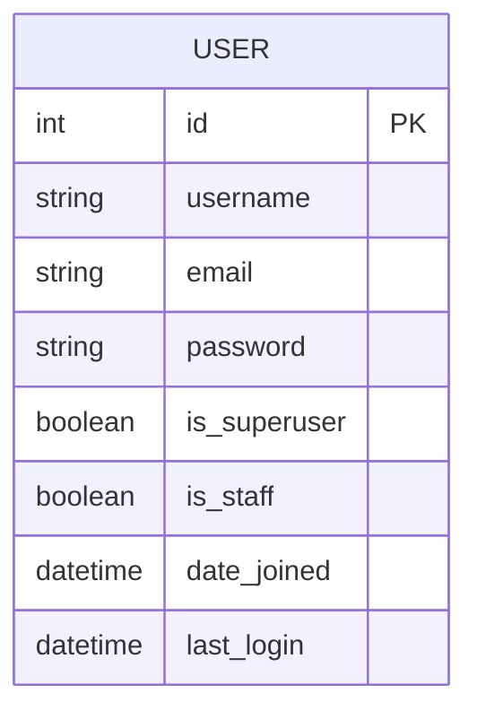

## 1. Architecture design



## 2. Technology Description
- Frontend: React@18 + tailwindcss@3 + vite
- Initialization Tool: vite-init
- Backend: Django@4 + Django REST Framework
- Database: SQLite (default Django database)
- Authentication: Django built-in auth + JWT tokens

## 3. Route definitions
| Route | Purpose |
|-------|---------|
| /login | Login page for admin authentication |
| /dashboard | Main dashboard page after successful login |
| / | Redirects to /login for unauthenticated users |

## 4. API definitions

### 4.1 Authentication API

**Login Endpoint**
```
POST /api/login/
```

Request:
| Param Name | Param Type | isRequired | Description |
|------------|------------|------------|-------------|
| email | string | true | Admin email address |
| password | string | true | Admin password |

Response:
| Param Name | Param Type | Description |
|------------|------------|-------------|
| token | string | JWT authentication token |
| user | object | User details (id, email) |
| status | string | Success status message |

Example Request:
```json
{
  "email": "admin@jhtmchurch.com",
  "password": "securepassword123"
}
```

Example Response:
```json
{
  "token": "eyJ0eXAiOiJKV1QiLCJhbGciOiJIUzI1NiJ9...",
  "user": {
    "id": 1,
    "email": "admin@jhtmchurch.com"
  },
  "status": "login_successful"
}
```

## 5. Server architecture diagram



## 6. Data model

### 6.1 Data model definition



### 6.2 Data Definition Language

**User Table (auth_user)**
```sql
-- Django automatically creates this table, but for reference:
CREATE TABLE auth_user (
    id INTEGER PRIMARY KEY AUTOINCREMENT,
    username VARCHAR(150) UNIQUE NOT NULL,
    email VARCHAR(254) UNIQUE NOT NULL,
    password VARCHAR(128) NOT NULL,
    is_superuser BOOLEAN DEFAULT 0,
    is_staff BOOLEAN DEFAULT 0,
    date_joined DATETIME NOT NULL,
    last_login DATETIME
);

-- Create admin user (via Django management command)
-- python manage.py createsuperuser
```

**JWT Token Handling**
```python
# Django REST Framework JWT settings
# Settings will be configured in Django settings.py
REST_FRAMEWORK = {
    'DEFAULT_AUTHENTICATION_CLASSES': [
        'rest_framework_simplejwt.authentication.JWTAuthentication',
    ],
}
```