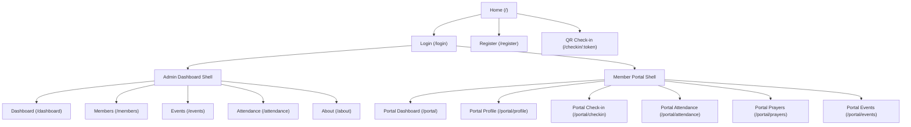

## 1. Product Overview
A CMS-style UI for JHTM that includes an Admin Dashboard and a Member Portal.
It standardizes navigation (routes, admin sidebar, member bottom tabs) while preserving all existing modules and paths.

## 2. Core Features

### 2.1 User Roles
| Role | Registration Method | Core Permissions |
|------|---------------------|------------------|
| Admin | Login (existing token in localStorage) | Access admin dashboard routes and manage church data modules |
| Member | Login (currently same token mechanism) | Access member portal routes and self-service features |

### 2.2 Feature Module
Our CMS UI consists of the following main pages:
1. **Public Entry & Auth**: home entry, login, register, QR check-in deep link.
2. **Admin Dashboard (CMS)**: sidebar navigation + top bar shell; dashboard, members, events, attendance, about.
3. **Member Portal**: member navigation (desktop sidebar + mobile bottom tabs); dashboard, profile, check-in, attendance, prayer requests, events.

### 2.3 Page Details
| Page Name | Module Name | Feature description |
|-----------|-------------|---------------------|
| Public Entry & Auth | Home | Show entry links to Admin Dashboard and Member Portal; link to About context (optional) |
| Public Entry & Auth | Login | Authenticate and store token/user in localStorage; redirect to /dashboard or /portal based on user choice |
| Public Entry & Auth | Register | Create account (existing flow); redirect to login |
| Public Entry & Auth | QR Check-in | Open /checkin/:token and allow check-in with provided token |
| Admin Dashboard (CMS) | Route protection | Require token for all admin pages; redirect to /login if missing |
| Admin Dashboard (CMS) | Admin shell | Render AppShell layout with sticky top bar + content outlet |
| Admin Dashboard (CMS) | Admin sidebar | Navigate using existing routes: /dashboard, /members, /events, /attendance, /about |
| Admin Dashboard (CMS) | Shared top bar | Provide search input (UI-only), notifications icon (UI-only), and logout |
| Member Portal | Route protection | Require token for all /portal* routes; redirect to /login if missing |
| Member Portal | Portal layout | Render portal navigation + page content consistently across portal routes |
| Member Portal | Desktop navigation | Show left sidebar navigation for portal pages (reuse portal nav items) |
| Member Portal | Mobile navigation (bottom tabs) | Provide bottom tab bar that navigates to existing /portal routes without changing paths |

## 3. Core Process
**Admin Flow**: User opens Home → Login → on success lands on /dashboard → uses Admin Sidebar to switch modules (/members, /events, /attendance, /about) → logout clears token and returns to /login.

**Member Flow**: User opens Home → Login → on success lands on /portal → uses portal navigation (desktop sidebar; mobile bottom tabs) to move between /portal/profile, /portal/checkin, /portal/attendance, /portal/prayers, /portal/events → logout clears token and returns to /login.

