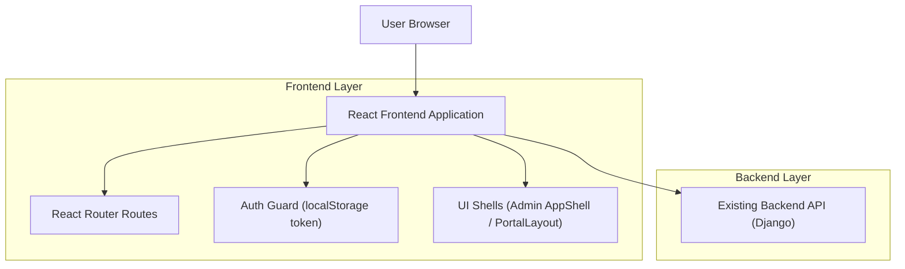

## 1.Architecture design

## 2.Technology Description
- Frontend: React@18 + react-router-dom@7 + TypeScript + tailwindcss@3 + vite
- Backend: Django (existing project backend/, API details out of scope for this UI structure spec)

## 3.Route definitions
| Route | Purpose |
|-------|---------|
| / | Public home/entry |
| /login | Login (creates token in localStorage) |
| /register | Register account |
| /checkin/:token | QR deep link check-in |
| /dashboard | Admin dashboard home (inside AppShell + ProtectedRoute) |
| /members | Admin members module |
| /events | Admin events module |
| /attendance | Admin attendance module |
| /about | Admin about page |
| /portal | Member portal dashboard |
| /portal/profile | Member profile |
| /portal/checkin | Member check-in |
| /portal/attendance | Member attendance history |
| /portal/prayers | Member prayer requests |
| /portal/events | Member events |

### Routing invariants (to avoid breaking existing modules)
- Do not rename or repath any of the above routes; navigation components must link to these exact paths.
- Admin pages must remain wrapped by: ProtectedRoute → AppShell → <Outlet />.
- Member pages must remain wrapped by: MemberPortalRoute → PortalLayout → (render current portal page content).
- Navigation must be data-driven from a single source of truth per surface:
  - Admin: Sidebar navItems (Dashboard/Members/Events/Attendance/About)
  - Portal: portalNavItems (Dashboard/Profile/Check-in/My Attendance/Prayer Requests/Events)
