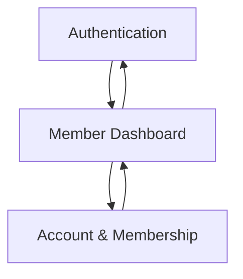

## 1. Product Overview
A secure Member Portal where members can sign in, view membership status, and access member-only resources.
It reduces manual support by letting members self-serve profile and membership information.

## 2. Core Features

### 2.1 User Roles
| Role | Registration Method | Core Permissions |
|------|---------------------|------------------|
| Guest (Unauthenticated) | None | Can view sign-in / sign-up screens only |
| Member (Authenticated) | Email + password sign-up (email confirmation) | Can view dashboard, manage profile, view membership status, access permitted resources |

### 2.2 Feature Module
Our Member Portal requirements consist of the following main pages:
1. **Authentication**: sign up, sign in, password reset.
2. **Member Dashboard**: membership summary, resource list (member-only), quick links.
3. **Account & Membership**: profile editing, membership details.

### 2.3 Page Details
| Page Name | Module Name | Feature description |
|-----------|-------------|---------------------|
| Authentication | Sign up | Create account with email + password; send email confirmation; show success / error states |
| Authentication | Sign in | Authenticate with email + password; handle invalid credentials; route to dashboard |
| Authentication | Password reset | Request reset email; set new password via reset link |
| Member Dashboard | Membership summary | Display current membership status (active/inactive), plan name, start/end dates |
| Member Dashboard | Resource access | List resources available to the member; open a resource link/file; block access when membership inactive |
| Member Dashboard | Session controls | Show member identity; allow logout |
| Account & Membership | Profile | View and update profile fields (name, phone, address optional); save and validate |
| Account & Membership | Membership details | View plan, renewal date/end date, and status; show guidance when inactive (e.g., “contact support”) |

## 3. Core Process
**Member Flow**
1. You sign up with email + password and confirm your email.
2. You sign in and land on the dashboard.
3. You view your membership status and access your available resources.
4. You update your profile or review membership details from the account page.
5. You log out.

