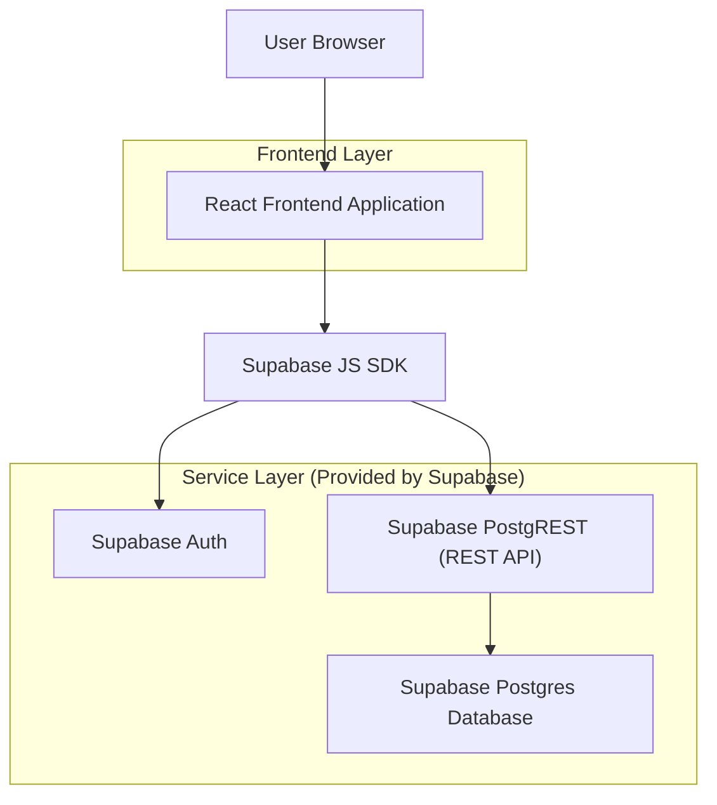
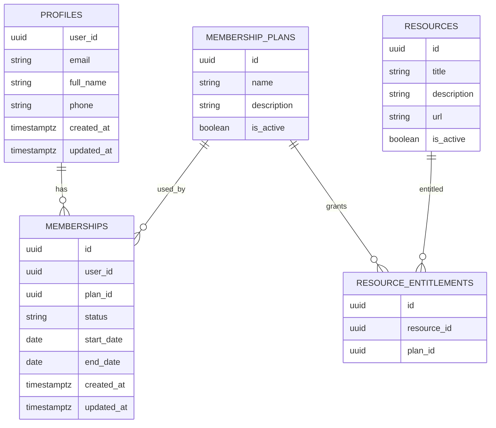

## 1.Architecture design


## 2.Technology Description
- Frontend: React@18 + TypeScript + tailwindcss@3 + vite
- Backend: Supabase (Auth + Postgres + PostgREST)

## 3.Route definitions
| Route | Purpose |
|-------|---------|
| /login | Sign in (email + password) |
| /signup | Sign up (email + password, confirmation instructions) |
| /reset-password | Request password reset email |
| /app | Member dashboard (membership summary + resources) |
| /app/account | Profile editing + membership details |

## 4.API definitions (If it includes backend services)
The portal uses Supabase PostgREST for RESTful CRUD over tables (plus Supabase Auth for sessions).

### 4.1 Shared TypeScript types (frontend)
```ts
export type UUID = string;

export type Profile = {
  user_id: UUID; // logical ref to auth.users.id
  email: string;
  full_name: string | null;
  phone: string | null;
  created_at: string;
  updated_at: string;
};

export type MembershipPlan = {
  id: UUID;
  name: string;
  description: string | null;
  is_active: boolean;
};

export type Membership = {
  id: UUID;
  user_id: UUID; // logical ref to auth.users.id
  plan_id: UUID; // logical ref to membership_plans.id
  status: "active" | "inactive";
  start_date: string; // YYYY-MM-DD
  end_date: string | null; // YYYY-MM-DD
  created_at: string;
  updated_at: string;
};

export type Resource = {
  id: UUID;
  title: string;
  description: string | null;
  url: string; // external URL or Supabase Storage signed URL generated on client
  is_active: boolean;
};

export type ResourceEntitlement = {
  id: UUID;
  resource_id: UUID; // logical ref to resources.id
  plan_id: UUID; // logical ref to membership_plans.id
};
```

### 4.2 Authentication (Supabase)
- Sign up: Supabase SDK `auth.signUp({ email, password })`
- Sign in: Supabase SDK `auth.signInWithPassword({ email, password })`
- Reset password: Supabase SDK `auth.resetPasswordForEmail(email)`
- Update password (after reset link): Supabase SDK `auth.updateUser({ password })`

### 4.3 Core REST endpoints (Supabase PostgREST)
Base URL: `https://<project-ref>.supabase.co/rest/v1`

1) Profiles
- `GET /profiles?select=*` (authenticated user receives their own row via RLS)
- `PATCH /profiles?user_id=eq.<uuid>` (update your profile)

2) Membership
- `GET /memberships?select=*` (authenticated user receives their own rows via RLS)
- `GET /membership_plans?select=*` (public read for plan list; optional)

3) Member resources (entitlement-based)
- `GET /resources?select=*` (returns resources that your active membership entitles via RLS)

Headers (all REST calls):
- `apikey: <SUPABASE_ANON_KEY>`
- `Authorization: Bearer <ACCESS_TOKEN>` (required for authenticated access)

## 6.Data model(if applicable)

### 6.1 Data model definition


### 6.2 Data Definition Language
```sql
-- PROFILES
CREATE TABLE IF NOT EXISTS public.profiles (
  user_id UUID PRIMARY KEY,
  email TEXT NOT NULL,
  full_name TEXT,
  phone TEXT,
  created_at TIMESTAMPTZ NOT NULL DEFAULT NOW(),
  updated_at TIMESTAMPTZ NOT NULL DEFAULT NOW()
);
CREATE INDEX IF NOT EXISTS idx_profiles_email ON public.profiles (email);

-- MEMBERSHIP PLANS
CREATE TABLE IF NOT EXISTS public.membership_plans (
  id UUID PRIMARY KEY DEFAULT gen_random_uuid(),
  name TEXT NOT NULL,
  description TEXT,
  is_active BOOLEAN NOT NULL DEFAULT TRUE
);
CREATE INDEX IF NOT EXISTS idx_membership_plans_active ON public.membership_plans (is_active);

-- MEMBERSHIPS (logical refs; no physical FK constraints)
CREATE TABLE IF NOT EXISTS public.memberships (
  id UUID PRIMARY KEY DEFAULT gen_random_uuid(),
  user_id UUID NOT NULL,
  plan_id UUID NOT NULL,
  status TEXT NOT NULL CHECK (status IN ('active','inactive')),
  start_date DATE NOT NULL,
  end_date DATE,
  created_at TIMESTAMPTZ NOT NULL DEFAULT NOW(),
  updated_at TIMESTAMPTZ NOT NULL DEFAULT NOW()
);
CREATE INDEX IF NOT EXISTS idx_memberships_user_id ON public.memberships (user_id);
CREATE INDEX IF NOT EXISTS idx_memberships_status ON public.memberships (status);

-- RESOURCES
CREATE TABLE IF NOT EXISTS public.resources (
  id UUID PRIMARY KEY DEFAULT gen_random_uuid(),
  title TEXT NOT NULL,
  description TEXT,
  url TEXT NOT NULL,
  is_active BOOLEAN NOT NULL DEFAULT TRUE
);
CREATE INDEX IF NOT EXISTS idx_resources_active ON public.resources (is_active);

-- RESOURCE ENTITLEMENTS
CREATE TABLE IF NOT EXISTS public.resource_entitlements (
  id UUID PRIMARY KEY DEFAULT gen_random_uuid(),
  resource_id UUID NOT NULL,
  plan_id UUID NOT NULL
);
CREATE INDEX IF NOT EXISTS idx_entitlements_plan_id ON public.resource_entitlements (plan_id);
CREATE INDEX IF NOT EXISTS idx_entitlements_resource_id ON public.resource_entitlements (resource_id);

-- RLS
ALTER TABLE public.profiles ENABLE ROW LEVEL SECURITY;
ALTER TABLE public.memberships ENABLE ROW LEVEL SECURITY;
ALTER TABLE public.resources ENABLE ROW LEVEL SECURITY;
ALTER TABLE public.resource_entitlements ENABLE ROW LEVEL SECURITY;
ALTER TABLE public.membership_plans ENABLE ROW LEVEL SECURITY;

-- PROFILES policies: user can read/write own profile
CREATE POLICY "profiles_select_own" ON public.profiles
  FOR SELECT TO authenticated
  USING (user_id = auth.uid());
CREATE POLICY "profiles_update_own" ON public.profiles
  FOR UPDATE TO authenticated
  USING (user_id = auth.uid())
  WITH CHECK (user_id = auth.uid());

-- MEMBERSHIPS policies: user can read own memberships
CREATE POLICY "memberships_select_own" ON public.memberships
  FOR SELECT TO authenticated
  USING (user_id = auth.uid());

-- MEMBERSHIP PLANS policies: allow public read (optional for showing plans)
CREATE POLICY "plans_select_public" ON public.membership_plans
  FOR SELECT TO anon
  USING (is_active = TRUE);
CREATE POLICY "plans_select_auth" ON public.membership_plans
  FOR SELECT TO authenticated
  USING (TRUE);

-- RESOURCES policies: user can read resources only if entitled by an ACTIVE membership
CREATE POLICY "resources_select_entitled" ON public.resources
  FOR SELECT TO authenticated
  USING (
    is_active = TRUE
    AND EXISTS (
      SELECT 1
      FROM public.resource_entitlements re
      JOIN public.memberships m
        ON m.plan_id = re.plan_id
      WHERE re.resource_id = resources.id
        AND m.user_id = auth.uid()
        AND m.status = 'active'
        AND (m.end_date IS NULL OR m.end_date >= CURRENT_DATE)
    )
  );

-- ENTITLEMENTS are not directly readable by members (keep internal)
-- (If you need to debug on client, add a SELECT policy for authenticated.)

-- Grants (baseline; RLS still applies)
GRANT USAGE ON SCHEMA public TO anon, authenticated;
GRANT SELECT ON public.membership_plans TO anon;
GRANT ALL PRIVILEGES ON public.profiles TO authenticated;
GRANT ALL PRIVILEGES ON public.memberships TO authenticated;
GRANT SELECT ON public.resources TO authenticated;
```
