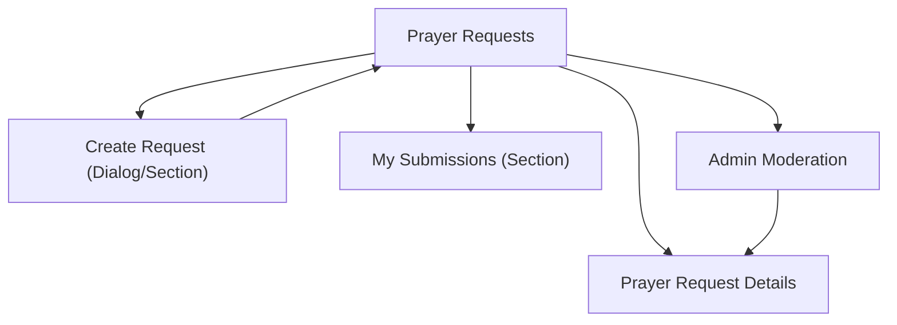

## 1. Product Overview
A Prayer Request module where members submit requests and the community can view them once approved.
Admins moderate requests to ensure appropriate content and correct visibility.

## 2. Core Features

### 2.1 User Roles
| Role | Registration Method | Core Permissions |
|------|---------------------|------------------|
| Member | Sign in (email/password or SSO) | Create prayer requests; view approved requests allowed for members; view own submission status |
| Admin | Member account flagged as admin | View all requests; approve/reject/archive; edit visibility; remove inappropriate content |

### 2.2 Feature Module
Our Prayer Request requirements consist of the following main pages:
1. **Prayer Requests**: request list, search/filter, create request entry point.
2. **Prayer Request Details**: full content view, status/visibility display.
3. **Admin Moderation**: review queue, approve/reject/archive, edit request fields.

### 2.3 Page Details
| Page Name | Module Name | Feature description |
|-----------|-------------|---------------------|
| Prayer Requests | Requests list | Show approved requests; support keyword search and basic filters (e.g., visibility). |
| Prayer Requests | Create request | Submit a new request with title/body, anonymity option, and visibility (public vs members). |
| Prayer Requests | My submissions | Show current user’s submitted requests with status (pending/approved/rejected/archived). |
| Prayer Request Details | Request content | Display title/body, created date, (optionally hidden) author name, and visibility. |
| Prayer Request Details | Status info | Show approval status to owner/admin; hide non-approved content from others. |
| Admin Moderation | Review queue | List pending requests with quick preview, submitter, timestamps, and requested visibility. |
| Admin Moderation | Moderation actions | Approve, reject (with optional reason), archive; edit title/body/visibility before approval. |

## 3. Core Process
**Member Flow**
1. Open Prayer Requests.
2. Create a request (title, details, anonymity, visibility) and submit.
3. View “My submissions” to see status.
4. After approval, the request becomes visible per visibility setting.

**Admin Flow**
1. Open Admin Moderation.
2. Review pending requests.
3. Approve (publish), reject (do not publish), or archive.
4. Optionally edit request content and visibility before approval.

