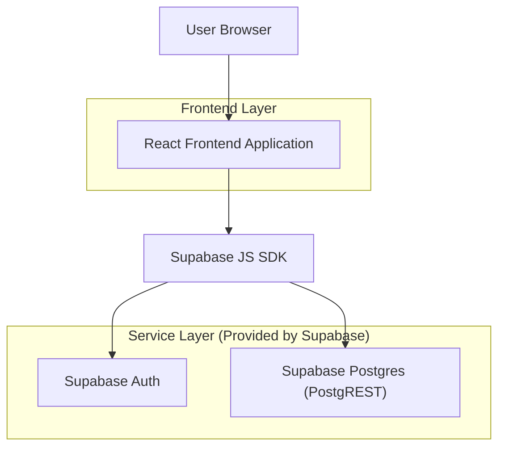
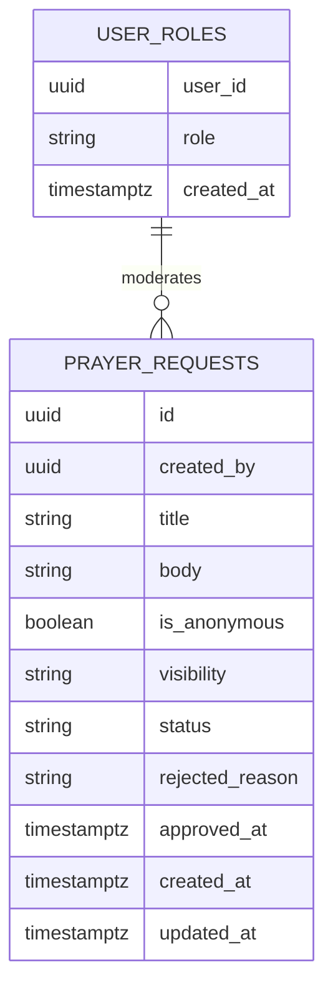

## 1.Architecture design


## 2.Technology Description
- Frontend: React@18 + vite + TypeScript
- Backend: Supabase (Auth + Postgres + PostgREST)

## 3.Route definitions
| Route | Purpose |
|-------|---------|
| /prayer-requests | Browse approved requests; create request entry point; view “My submissions” |
| /prayer-requests/:id | View request details (visibility gated) |
| /admin/prayer-requests | Admin queue + moderation actions |

## 4.API definitions (If it includes backend services)
No custom backend server. The module uses Supabase PostgREST endpoints.

### 4.1 Core REST endpoints (PostgREST)
Base: `https://<project>.supabase.co/rest/v1`

**List approved requests (public)**
- `GET /prayer_requests?select=*&status=eq.approved&visibility=eq.public&order=created_at.desc`

**List approved requests (members)**
- `GET /prayer_requests?select=*&status=eq.approved&visibility=in.(public,members)&order=created_at.desc` (requires auth)

**Create request (member)**
- `POST /prayer_requests`

**Get request by id**
- `GET /prayer_requests?id=eq.<uuid>&select=*`

**Admin moderation update**
- `PATCH /prayer_requests?id=eq.<uuid>` (e.g., set `status`, edit `title/body/visibility`)

TypeScript types (shared)
```ts
type PrayerVisibility = 'public' | 'members'

type PrayerStatus = 'pending' | 'approved' | 'rejected' | 'archived'

type PrayerRequest = {
  id: string
  created_by: string
  title: string
  body: string
  is_anonymous: boolean
  visibility: PrayerVisibility
  status: PrayerStatus
  rejected_reason: string | null
  created_at: string
  updated_at: string
  approved_at: string | null
}
```

## 6.Data model(if applicable)

### 6.1 Data model definition


### 6.2 Data Definition Language
User roles (user_roles)
```
CREATE TABLE user_roles (
  user_id UUID PRIMARY KEY,
  role TEXT NOT NULL CHECK (role IN ('admin','member')),
  created_at TIMESTAMPTZ NOT NULL DEFAULT NOW()
);

CREATE INDEX idx_user_roles_role ON user_roles(role);

ALTER TABLE user_roles ENABLE ROW LEVEL SECURITY;

-- Only authenticated users can read their own role; admins can read all
CREATE POLICY "read_own_role" ON user_roles
  FOR SELECT TO authenticated
  USING (user_id = auth.uid());

CREATE POLICY "admin_read_roles" ON user_roles
  FOR SELECT TO authenticated
  USING (EXISTS (SELECT 1 FROM user_roles ur WHERE ur.user_id = auth.uid() AND ur.role = 'admin'));
```

Prayer requests (prayer_requests)
```
CREATE TABLE prayer_requests (
  id UUID PRIMARY KEY DEFAULT gen_random_uuid(),
  created_by UUID NOT NULL,
  title TEXT NOT NULL,
  body TEXT NOT NULL,
  is_anonymous BOOLEAN NOT NULL DEFAULT false,
  visibility TEXT NOT NULL DEFAULT 'members' CHECK (visibility IN ('public','members')),
  status TEXT NOT NULL DEFAULT 'pending' CHECK (status IN ('pending','approved','rejected','archived')),
  rejected_reason TEXT NULL,
  approved_at TIMESTAMPTZ NULL,
  created_at TIMESTAMPTZ NOT NULL DEFAULT NOW(),
  updated_at TIMESTAMPTZ NOT NULL DEFAULT NOW()
);

CREATE INDEX idx_prayer_requests_status_created_at ON prayer_requests(status, created_at DESC);
CREATE INDEX idx_prayer_requests_visibility_created_at ON prayer_requests(visibility, created_at DESC);
CREATE INDEX idx_prayer_requests_created_by_created_at ON prayer_requests(created_by, created_at DESC);

ALTER TABLE prayer_requests ENABLE ROW LEVEL SECURITY;

-- Anonymous/public can only read approved+public
CREATE POLICY "anon_read_approved_public" ON prayer_requests
  FOR SELECT TO anon
  USING (status = 'approved' AND visibility = 'public');

-- Authenticated can read approved+public/members, and always read own
CREATE POLICY "auth_read_approved_or_own" ON prayer_requests
  FOR SELECT TO authenticated
  USING (
    (status = 'approved' AND visibility IN ('public','members'))
    OR (created_by = auth.uid())
    OR (EXISTS (SELECT 1 FROM user_roles ur WHERE ur.user_id = auth.uid() AND ur.role = 'admin'))
  );

-- Members can insert their own requests (always pending)
CREATE POLICY "auth_insert_own_pending" ON prayer_requests
  FOR INSERT TO authenticated
  WITH CHECK (created_by = auth.uid() AND status = 'pending');

-- Members can update their own request only while pending (content edits)
CREATE POLICY "auth_update_own_pending" ON prayer_requests
  FOR UPDATE TO authenticated
  USING (created_by = auth.uid() AND status = 'pending')
  WITH CHECK (created_by = auth.uid() AND status = 'pending');

-- Admin can update any request (moderation)
CREATE POLICY "admin_update_any" ON prayer_requests
  FOR UPDATE TO authenticated
  USING (EXISTS (SELECT 1 FROM user_roles ur WHERE ur.user_id = auth.uid() AND ur.role = 'admin'))
  WITH CHECK (EXISTS (SELECT 1 FROM user_roles ur WHERE ur.user_id = auth.uid() AND ur.role = 'admin'));

-- Grants (baseline guidance)
GRANT SELECT ON prayer_requests TO anon;
GRANT ALL PRIVILEGES ON prayer_requests TO authenticated;
GRANT ALL PRIVILEGES ON user_roles TO authenticated;
```

Notes
- `created_by` is a logical link to `auth.users.id` (no physical FK constraint).
- Use a DB trigger or client-side write to set `updated_at` on update (implementation choice).