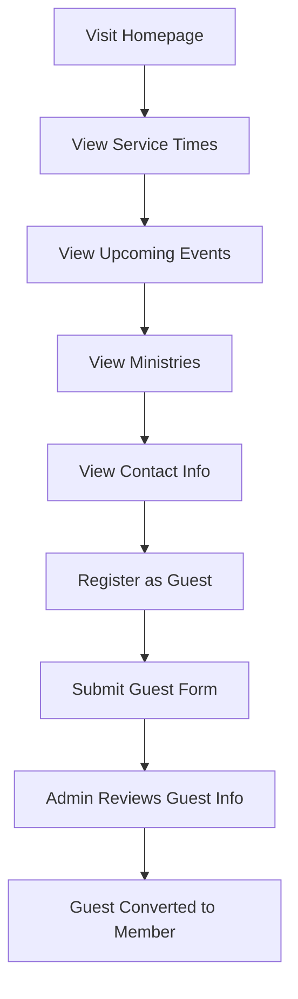
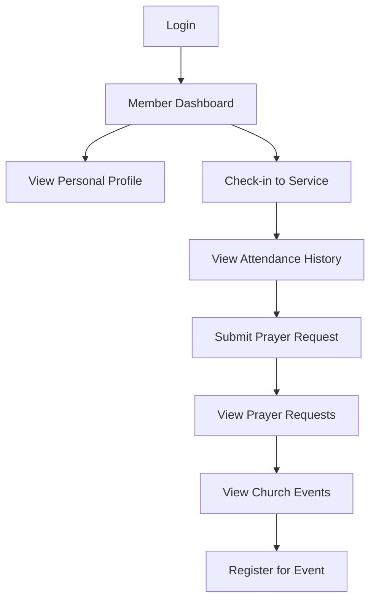
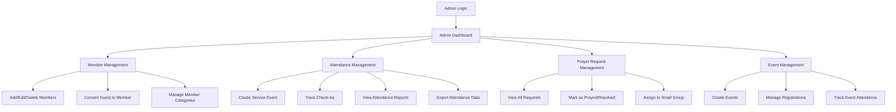
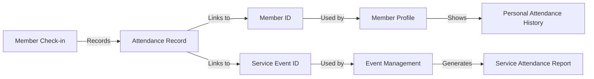
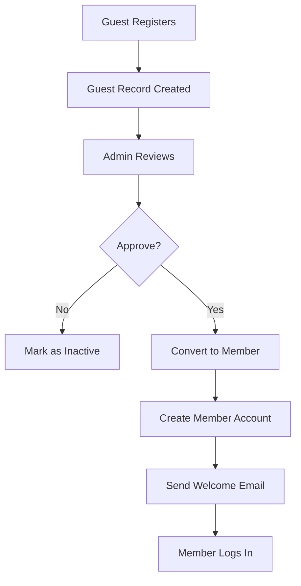

# Church Management System - Improved System Flow Plan

## Current System Analysis

| Component | Current State |
|-----------|---------------|
| **Backend** | Django with JWT auth, empty models |
| **Frontend** | React + TypeScript + Tailwind |
| **Authentication** | Email/password with JWT tokens |
| **Members** | Stored in localStorage (frontend only) |
| **Attendance** | Count-only (total per service) |
| **Pages** | Home, Login, Dashboard, Members, Events, Attendance, About |

---

## Proposed System Architecture

### User Roles

| Role | Description | Access Level |
|------|-------------|--------------|
| **Guest** | Unauthenticated visitor | Public pages only |
| **Member** | Registered church member | Member portal + attendance |
| **Admin** | Church staff/pastors | Full system access |

---

## User Journeys

### 1. Guest Journey



**Guest Capabilities:**
- View homepage with church info
- View service times and location
- View upcoming events (public)
- View ministry information
- Submit guest registration form
- Submit prayer request (optional - can be anonymous)

### 2. Member Journey



**Member Capabilities:**
- Login to member portal
- View and edit personal profile
- Check-in to weekly services (with QR or manual)
- View personal attendance history
- Submit prayer requests
- View church events and register
- Update contact information

### 3. Admin Workflow



**Admin Capabilities:**
- Full CRUD on members
- View/manage all guest registrations
- Create and manage service events
- Take attendance (who attended)
- View attendance reports and trends
- Manage prayer requests
- Create and manage church events
- Access system analytics

---

## Module Connections

### Attendance ↔ Members



**Connection Details:**
- Each check-in = 1 attendance record
- Record contains: member_id, service_event_id, check_in_time
- Members can view their own attendance history
- Admins can view all attendance records
- Reports show attendance trends over time

### Prayer Requests ↔ Members


**Connection Details:**
- Prayer requests linked to member (or anonymous for guests)
- Status: Pending → In Progress → Answered/Resolved
- Admins can assign to prayer teams or small groups
- Members can view their own request history
- Answered prayers can be shared (optional)

### Guests ↔ Members Conversion



**Connection Details:**
- Guest: name, email, phone, visit_date, referred_by, notes
- Admin can convert guest to member
- Guest's visit history preserved
- New member inherits guest's attendance if they visited

---

## New Pages/Routes Required

| Route | Access | Description |
|-------|--------|-------------|
| `/` | Public | Homepage (existing) |
| `/login` | Public | Login page (existing) |
| `/register` | Public | Guest registration |
| `/portal` | Member | Member portal home |
| `/portal/profile` | Member | View/edit profile |
| `/portal/checkin` | Member | Service check-in |
| `/portal/attendance` | Member | Personal attendance |
| `/portal/prayers` | Member | Submit/view prayers |
| `/portal/events` | Member | View/register events |
| `/admin` | Admin | Dashboard (existing) |
| `/admin/members` | Admin | Member management |
| `/admin/attendance` | Admin | Attendance tracking |
| `/admin/prayers` | Admin | Prayer request management |
| `/admin/guests` | Admin | Guest management |

---

## Data Models (Backend)

### Member
```
- id: UUID
- user: ForeignKey (User)
- name: string
- email: string
- phone: string
- category: enum (Youth, Pastor, Leader, Member)
- gender: enum
- birthdate: date
- ministry: string
- status: enum (Active, Pending, Inactive)
- created_at: datetime
- updated_at: datetime
```

### Guest
```
- id: UUID
- name: string
- email: string
- phone: string
- visit_date: date
- referred_by: string
- notes: text
- converted_to_member: ForeignKey (Member, nullable)
- created_at: datetime
```

### ServiceEvent
```
- id: UUID
- name: string
- service_type: enum (Sunday Worship, Prayer Meeting, Youth, etc.)
- date: date
- time: time
- location: string
- status: enum (Scheduled, In Progress, Completed, Cancelled)
```

### Attendance
```
- id: UUID
- member: ForeignKey (Member)
- service_event: ForeignKey (ServiceEvent)
- check_in_time: datetime
- checked_in_by: ForeignKey (Admin)
```

### PrayerRequest
```
- id: UUID
- member: ForeignKey (Member, nullable)
- is_anonymous: boolean
- request_text: text
- status: enum (Pending, In Progress, Answered, Archived)
- prayed_count: integer
- created_at: datetime
- updated_at: datetime
```

---

## Implementation Priority

### Phase 1: Core Infrastructure
1. Create backend models (Member, Guest, ServiceEvent, Attendance, PrayerRequest)
2. Set up API endpoints for each model
3. Update frontend to use API instead of localStorage

### Phase 2: Member Portal
1. Create member registration flow
2. Build member dashboard
3. Implement profile management
4. Add member-specific views

### Phase 3: Attendance Enhancement
1. Service event management
2. Check-in system (QR code or manual)
3. Individual attendance tracking
4. Reports and analytics

### Phase 4: Prayer Request Module
1. Prayer request form
2. Admin management interface
3. Status workflow
4. Notification system

---

## Summary

This plan creates a complete system where:

1. **Guests** can register, submit prayer requests, and view church info
2. **Members** have a personal portal to check-in, track attendance, and request prayers
3. **Admins** have full control over all modules with clear workflows
4. **All modules connect** through shared data (member IDs, event IDs)

The system flow is logical and separates concerns between public, member, and admin areas while maintaining data integrity through proper relationships.
